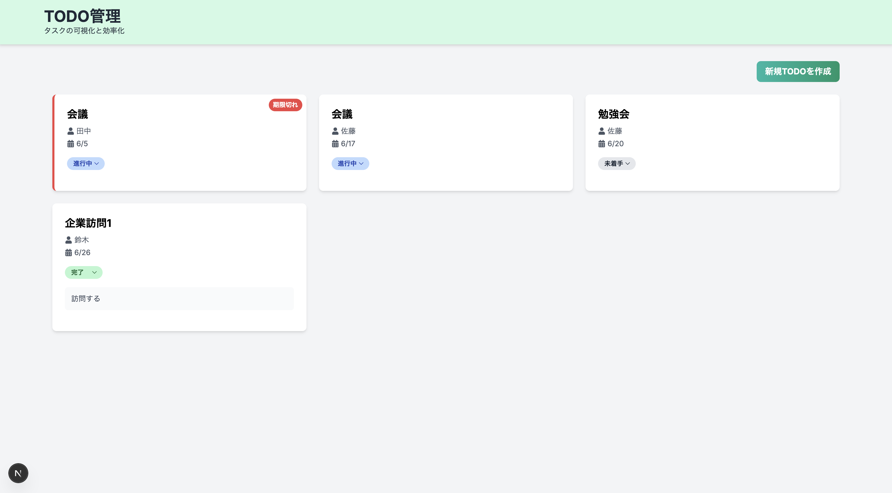

# Todo-app

First, run the development server:

このアプリケーションはToDoタスクを作成し、チームタスクを効率的に管理するものです。

## アプリケーションのイメージ

## 機能一覧

### トップ画面

アプリ起動時のメイン画面です。新規TODOを作成ボタンをクリックすることでToDoタスクを作成することができます。

### タスク追加

それぞれのテキストボックスに入力したあと、作成ボタンをクリックすることでTodoタスクが追加されます。

### タスク一覧

現在のタスク一覧が表示され、未着手、進行中、完了を瞬時に把握でき、進捗具合を変更、タスクの削除を行えません。また、期限が切れているタスクは赤く表示されます。

---

## 使用技術
-   **Next.js**
-   **React**
-   **TypeScript**
-   **Tailwind CSS**
-   **zod**
-   **React Hook Form**

